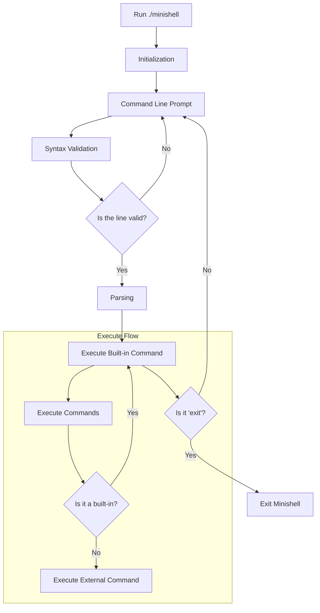

<div align="center">
<p><a href="https://www.hive.fi/en/curriculum">Hive (42 School Network)</a></p>  

<h1>Minishell</h1> 

</div>

#### Introduction  
Minishell is a lightweight shell that's similar to standard Unix shells (like bash). It supports both interactive and non-interactive modes, signal handling, command history, built-in commands, and external executables with piping and redirection.  

#### Table of Contents

- [Features](#features)
  - [Parser and command line prompt](#parser-and-command-line-prompt)
  - [Signals](#signals-command-line-prompt)
  - [Builtins](#builtins)
  - [External commands](#external-commands)
- [Project structure](#project-structure)
- [Project diagram](#project-diagram)
- [Installation](#installation)

## Features

### Parser and command line prompt

**Command line prompt and history**

- This project uses `readline` library to show a prompt and capture user input.
- A working history of commands is maintained.  

**Parser** 
- It uses an AST (Abstract Syntax Tree) linked list to store user input.   
- Tokenises input using special characters (`|`, `<`, `>`, `<<`, `>>`, `$`, etc.).  
- Handles single (`'`) and double quotes (`"`) syntax.  
- Checks for common syntax errors (e.g., unclosed quotes).  
- Expands environment variables (using `$` notation) and `$?` for the exit status of the last foreground command.

### Signals

**Signal handling**  
The shell supports the following key signals in both interactive and non-interactive modes:  

| Key    | Interactive Mode        | Non-Interactive Mode          |
| :----: | ------------------      | ----------------------        |
| Ctrl-C | Displays a new prompt.  | Interrupts a running process  |
| Ctrl-D | Exits the shell.        | Signals EOF, ending input.    |
| Ctrl-\ | Does nothing (ignored). | Terminates process.           |

### Builtins

Built-in commands are executed directly by the shell without calling external binaries. They follow the convention of returning '0' on success or a non-zero value on error (accessible via `$?`). Each builtin receives an array of strings as arguments (for example, "echo Hello!" is tokenized to `["echo", "Hello!", NULL]` and then executed as `builtin_echo(&args[1])`).  

**Supported Built-ins:**
- `echo` (supports `-n` option for omitting the newline)  
- `cd` (changes the current working directory using relative or absolute paths)  
- `pwd` (prints the current working directory)  
- `export` (sets environment variables)  
- `unset` (removes environment variables)  
- `env` (displays the current environment)  
- `exit` (exits the shell)  

### External commands

The shell can run external commands by searching the executable in the directories specified by the `PATH` variable.  
**Execution flow:**
-	Search for the executable in the `PATH`.
-	Create a new process using `fork()` and execute the command with `execve()`.  

**Piping and redirection:**
-	Pipe (`|`): support for piping output between processes.  
-	Redirections: 
    * `<` redirects input.   
    * `>` redirects output.  
    * `<<` reads input until a specified delimiter is encountered (here-document).   
    * `>>` appends output.  
- Supports combining here-documents (`<<`) with pipes.  

## Project structure

```css
minishell/
│
├── libft/                    # Submodule libft
│
├── include/                  # Header files
│   ├── minishell.h
│   └── constants.h
│
├── src/                      # Source files
│   ├── builtins/
│   │   ├── utils/..
│   │   └── *.c
│   ├── constructor/
│   │   └── *.c
│   ├── destructor/
│   │   └── *.c
│   ├── environment/
│   │   └── *.c
│   ├── execution/
│   │   ├── utils/..
│   │   └── *.c
│   ├── parser/
│   │   └── *.c
│   ├── signals/
│   │   └── *.c
│   └── main.c
│
├── ...
└── Makefile                  # Building project tool

```

## Project diagram

<div style="width: 400px; height: auto; overflow: auto;">
<pre>



</pre> </div>

## Installation

1. Clone the repository and build the project using the provided `Makefile`:  
```bash
git clone https://github.com/kerito-cl/minishell.git
cd minishell
make
```

2. Run minishell:  
```bash
./minishell
```

**Other commands:**  
	* `make clean` will remove all .o' files from the directory.  
	* `make fclean` will remove all .o' and executable files.  
	* `make re` will trigger the fclean command and rebuild the program.   


________  
<div align="center">
<p>Made by <a href="https://github.com/kerito-cl">Matias Quero</a> and <a href="https://github.com/ipersids">Julia Persidskaia</a>.</p>
</div>