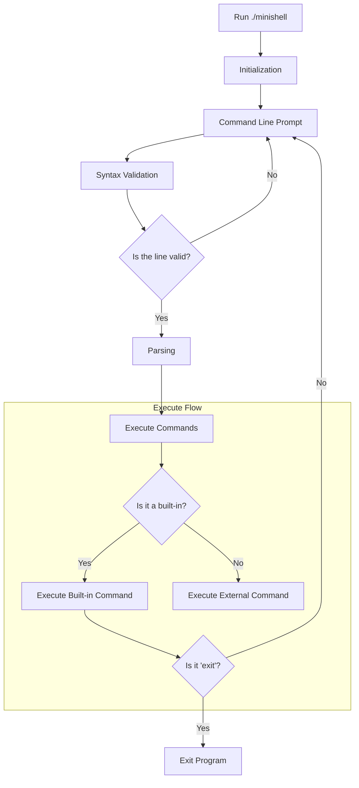

<div align="center">
<!-- <p><a href="https://www.hive.fi/en/curriculum">Hive (42 School Network)</a></p> -->
<h1>Minishell</h1> 
</div>

### Project planning:  

#### 1. Signals, command line prompt, data management.   
- [x] Support `Ctrl-C`, `Ctrl-D`, and `Ctrl-\` for interactive mode  
- [x] Non-interactive mode  

| Key    | Interactive Mode        | Non-Interactive Mode                        |
| :-----: | ------------------      | ----------------------                     |
| Ctrl-C | Displays a new prompt.  | Interrupts a running process if not ignored. |
| Ctrl-D | Exits the shell.        | Signals EOF, ending input.                  |
| Ctrl-\ | Does nothing (ignored). | Terminates process.                         |

- [x] Display a prompt when waiting for a new command (`readline`).  
- [x] Have a working history.  
- [x] Data management:  
    * Region-based memory management - arena?  
    * Basic struct with pointer to array (environment copy) and AST linked-list?  
    * Define key structures and error system  

#### 2. Parser and syntax validation   
- [ ] Should we pre-validate syntax before actual parsing (like Backus-Naur Form (BNF))?   
- [ ] AST (abstract syntax tree) parser vs split to linked list | array?
    * Tokenize input using spaces and special characters (`|`, `<`, `>`, `<<`, `>>`, `$`, `||` ...)  
    * Handle `’` (single quote) which should prevent the shell from interpreting the metacharacters in the quoted sequence.    
	* Handle `"` (double quote) which should prevent the shell from interpreting the metacharacters in the quoted sequence except for `$` (dollar sign).
    * Validate syntax in general (e.g., no unclosed quotes)    

#### 3. Builtins  
Built-in commands are executed directly by the shell and are part of the shell itself. These commands do not require external binaries or files to execute. All commands should return zero in success and not-zero int overwise (we need handle `$?`).  

It takes an array of array of chars as argument (the command should be skipped, ex: `"echo Hello!"` -> `char **args = ["echo", "Hello!", NULL]` -> `builtin_echo(&args[1])`).  

- [x] `echo` with option `-n`. Outputs text to the terminal with new lin or without (if `-n` was used).  
- [x] `cd` with only a relative or absolute path changes the current working directory.  
- [x] `pwd` with no options  
- [x] `export` with no options sets environment variables.  
- [x] `unset` with no options unsets environment variables.  
- [x] `env` with no options or arguments  
- [x] `exit` with no options  

#### 4. External commands  
The shell must search for the executable in directories specified in the PATH variable and spawn a new process to run it: search the `PATH`, create a new process (`fork()`) and execute (`execve()`) to run the command.   
- [x] Search and launch the right executable (based on the PATH variable or using a relative or an absolute path).  
- [x] Pipes (`|`)  
- [ ] Implement redirections:
    * `<` should redirect input.  
    * `>` should redirect output.
    * `<<` should be given a delimiter, then read the input until a line containing the delimiter is seen. However, *it doesn’t have to update the history.*
    * `>>` should redirect output in append mode.
- [x] Handle environment variables ($ followed by a sequence of characters) which should expand to their values.  
- [ ] Handle `$?` which should expand to the exit status of the most recently executed foreground pipeline.

#### Bonus  
- [ ] `&&` and `||` with parenthesis for priorities.  
- [ ] Wildcards `*` should work for the current working directory.  

**Project directories structure**  

```css
minishell/
│
├── libft/                    # Submodule libft
│
├── include/                  # Header files
│   ├── constants.h
│   ├── minishell.h
│   └── structures.h
│
├── src/                      # Source files
│   ├── signals/
│   │   └── *.c
│   ├── parser/
│   │   └── *.c
│   ├── builtin/
│   │   └── *.c
│   ├── utils/
│   │   └── *.c
│   ├── environment/
│   │   └── *.c
│   ├── pipelines/
│   │   └── *.c
│   ├── .../
│   │   └── *.c
│   └── main.c
│
├── ...
└── Makefile                  # Building project tool

```

**Project diagram**  

<div style="width: 400px; height: auto; overflow: auto;">
<pre>


</pre> </div>

________  
<div align="center">
<p>Made by <a href="https://github.com/kerito-cl">Matias Quero</a> and <a href="https://github.com/ipersids">Julia Persidskaia</a>.</p>
</div>